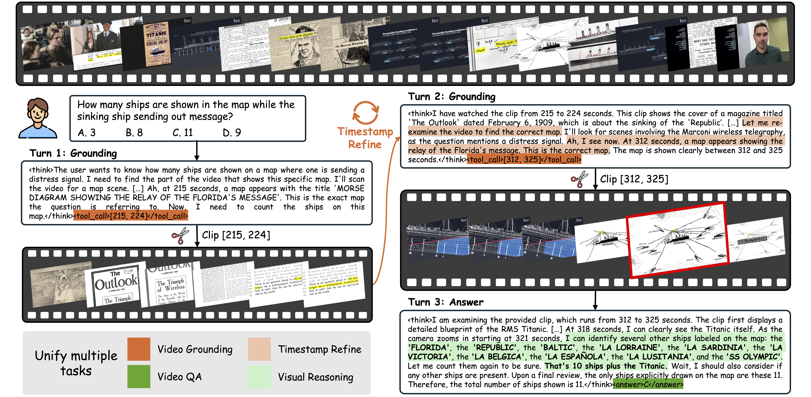

# VideoTemp-o3: Harmonizing Temporal Grounding and Video Understanding in Agentic Thinking-with-Videos

<div align="center" style="font-size: 15pt">

<a href='https://arxiv.org/abs/2602.07801'></a>
<a href='https://huggingface.co/models'></a>
<a href='https://huggingface.co/datasets'></a>
<a href='https://huggingface.co/datasets'></a>

</div>

## Overview



Illustration of the agentic pipeline in VideoTemp-o3. Given a video QA pair, the model performs on-demand temporal grounding to locate the most relevant segment, then refines it iteratively. Finally, it produces a reliable answer grounded in the pertinent visual evidence.

## Todo List

- [x] Release the paper of VideoTemp-o3.
- [x] Release training and evaluation code.
- [ ] Release the checkpoints of VideoTemp-o3.
- [ ] Release SFT and RL training data.
- [ ] Release VideoTemp-Bench.

## Environment Setup

```bash
conda create -n videotemp_o3 python=3.12 -y
conda activate videotemp_o3

# Our CUDA version is 12.9
# Install vLLM v0.11.0
pip install https://github.com/vllm-project/vllm/releases/download/v0.11.0/vllm-0.11.0+cu129-cp38-abi3-manylinux1_x86_64.whl

# Install ms-swift (from source, recommended)
cd ms-swift
pip install -e '.[all]' -U
# Or install ms-swift v3.10.0 directly from PyPI:
# pip install 'ms-swift[all]==3.10.0' -U

# IMPORTANT: disable vLLM prefix caching in ms-swift
# Edit: <conda-env>/lib/python3.12/site-packages/swift/llm/infer/infer_engine/vllm_engine.py, line 126
# Change: enable_prefix_caching=enable_prefix_caching
# To:     enable_prefix_caching=False

# Install flash-attn (CUDA 12 + PyTorch 2.8)
pip install https://github.com/Dao-AILab/flash-attention/releases/download/v2.8.1/flash_attn-2.8.1+cu12torch2.8cxx11abiFALSE-cp312-cp312-linux_x86_64.whl

# Install DeepSpeed
pip install deepspeed==0.16.9
```

## Data Preparation

### SFT Data

Download the SFT data from [Hugging Face](https://arxiv.org/abs/2602.07801) and place it under `sft/data/`. The expected directory structure is:

```
sft/data/
├── wo_tool_call/          # cold-start data (no tool call)
│   ├── activitynet.jsonl
│   ├── charades.jsonl
│   ├── vidchapters.jsonl
│   ├── video_r1_image_mc.jsonl
│   └── video_r1_video.jsonl
└── wi_tool_call/          # tool-call data
    ├── activitynet.jsonl
    ├── longvila.jsonl
    └── qvhighlight.jsonl
```

### RL Data

Download the RL data from [Hugging Face](https://arxiv.org/abs/2602.07801) and place it under `rl/data/`. The expected directory structure is:

```
rl/data/
├── qa.jsonl               # video QA reward data
└── grounding.jsonl        # temporal grounding reward data
```

## Training

### SFT

```bash
bash sft/sft.sh
```

### RL (GRPO)

RL training uses 6 GPUs for GRPO and 2 GPUs for the rollout engine.

**Step 1 — Start the rollout engine** (uses GPUs 6, 7):

```bash
bash rl/rollout.sh
```

**Step 2 — Start GRPO training** (uses GPUs 0–5), once the rollout engine is ready:

```bash
bash rl/grpo.sh
```

## Evaluation

### Download Benchmark Data

| Benchmark | Download |
|---|---|
| MLVU | https://huggingface.co/datasets/MLVU/MLVU_Test |
| Video-MMMU | https://huggingface.co/datasets/lmms-lab/VideoMMMU |
| Video-MME | https://huggingface.co/datasets/lmms-lab/Video-MME |
| LVBench | https://huggingface.co/datasets/zai-org/LVBench |
| VideoTemp-Bench | https://huggingface.co/datasets |

Place the downloaded data under the corresponding `eval/<benchmark>/data/` directory.

### Run Inference

**Step 1 — Deploy the vLLM inference engine:**

```bash
bash eval/7b_deploy_256.sh
```

**Step 2 — Run the evaluation script for each benchmark:**

```bash
# VideoTemp-Bench (MCQ)
python eval/videotemp/videotemp.py

# VideoTemp-Bench (Grounding)
python eval/videotemp/videotemp-g.py

# Video-MME
python eval/videomme/videomme.py

# MLVU
python eval/mlvu/mlvu.py

# Video-MMMU
python eval/videommmu/videommmu.py

# LVBench
python eval/lvbench/lvbench.py
```

### Score Results

All benchmarks share a unified scoring script:

```bash
# VideoTemp MCQ (broken down by video duration)
python eval/score.py videotemp

# VideoTemp Grounding (mIoU + R@{0.3, 0.5, 0.7})
python eval/score.py videotemp-g

# Video-MME
python eval/score.py videomme --return_categories_accuracy --return_task_types_accuracy

# MLVU
python eval/score.py mlvu

# Video-MMMU
python eval/score.py videommmu

# LVBench
python eval/score.py lvbench
```

Each subcommand accepts `--input_file <path>` to override the default output path. Run `python eval/score.py <benchmark> --help` for details.

## Citation

If you find our work useful, please consider citing:

```bibtex
@article{liu2026videotemp,
  title={VideoTemp-o3: Harmonizing Temporal Grounding and Video Understanding in Agentic Thinking-with-Videos},
  author={Liu, Wenqi and Wang, Yunxiao and Ma, Shijie and Liu, Meng and Su, Qile and Zhang, Tianke and Fan, Haonan and Liu, Changyi and Jiang, Kaiyu and Chen, Jiankang and Tang, Kaiyu and Wen, Bin and Yang, Fan and Gao, Tingting and Li, Han and Wei, Yinwei and Song, Xuemeng},
  journal={arXiv preprint arXiv:2602.07801},
  year={2026}
}
```